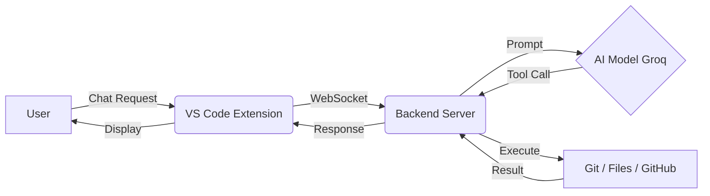

# 🚀 DevOps AI Agent for VS Code

Welcome to the **DevOps AI Agent**! This project is an intelligent assistant that lives inside VS Code and helps you automate DevOps tasks, manage Git repositories, and handle file operations using natural language.

## 🌟 Features

### 🤖 **AI-Powered Automation**
- **Natural Language Commands**: Just ask "Push my code" or "Create a PR", and the agent does it.
- **Context Aware**: Understands your workspace, files, and current Git status.
- **Real-Time Feedback**: Shows exactly what tool is being executed (e.g., "🔧 Executing: git_commit...").

### 🐙 **Git & GitHub Integration**
- **Smart Git Operations**: `init`, `commit`, `push`, `pull`, `status`.
- **Branch Management**: Create, switch, and manage branches automatically.
- **GitHub Automation**: 
  - Create Repositories
  - Create Pull Requests
  - List Issues
  - Review PRs

### 📂 **File System Control**
- **Read & Write**: The agent can read code files and write new content (e.g., "Update README").
- **Search**: Find files instantly using patterns.
- **Safety**: Restricted to the current workspace for security.

---

## 🛠️ Architecture: How It Works

The project consists of two main parts that talk to each other:

1.  **VS Code Extension (Frontend)**:
    - Provides the Chat Interface in the sidebar.
    - Captures your requests and sends them to the backend.
    - Displays real-time status updates and AI responses.

2.  **Node.js Backend (The Brain)**:
    - Runs a local server (WebSocket).
    - Uses **Groq AI** (Llama 3.1) to understand your intent.
    - Executes **Tools** (Git commands, File I/O, API calls) based on the AI's decision.



---

## 🚀 Setup Guide

Follow these steps to get the DevOps Agent running on your machine.

### 1. Prerequisites
- **Node.js** (v18 or higher)
- **Git** installed and configured
- **VS Code**
- **Groq API Key** (Get one from [console.groq.com](https://console.groq.com))
- **GitHub Token** (For creating repos/PRs)

### 2. Installation

#### **Backend Setup**
1.  Navigate to the `backend` folder:
    ```bash
    cd backend
    ```
2.  Install dependencies:
    ```bash
    npm install
    ```
3.  Configure Environment:
    - Create a `.env` file (copy from `.env.example`):
      ```bash
      cp .env.example .env
      ```
    - Add your keys:
      ```env
      PORT=3000
      AI_PROVIDER=groq
      GROQ_API_KEY=your_groq_api_key_here
      GROQ_MODEL=llama-3.1-8b-instant
      GITHUB_TOKEN=your_github_personal_access_token
      ```
4.  Start the Server:
    ```bash
    npm run dev
    ```
    *You should see: "✅ DevOps Agent Backend is ready!"*

#### **Extension Setup**
1.  Open the `extension` folder in VS Code.
2.  Install dependencies:
    ```bash
    npm install
    ```
3.  Run the Extension:
    - Press `F5` to open a new VS Code window with the extension loaded.
    - OR compile and install the `.vsix` file.

### 3. Usage
1.  Open the **DevOps Agent** sidebar in VS Code.
2.  Ensure the backend is running (`npm run dev`).
3.  Click **"Connect to Agent"**.
4.  Start chatting! 
    - *"Initialize a git repo and push this code"*
    - *"Create a feature branch called login-page"*
    - *"Review my changes"*

---

## 🤝 Contributing
Feel free to add new tools in `backend/src/agent/tools/` and register them in `server.ts`. The agent automatically picks up new capabilities!

Happy Coding! 🚀
